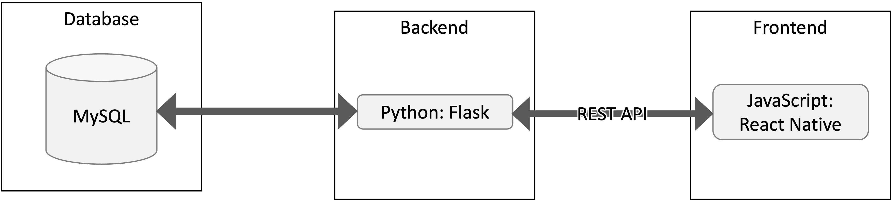
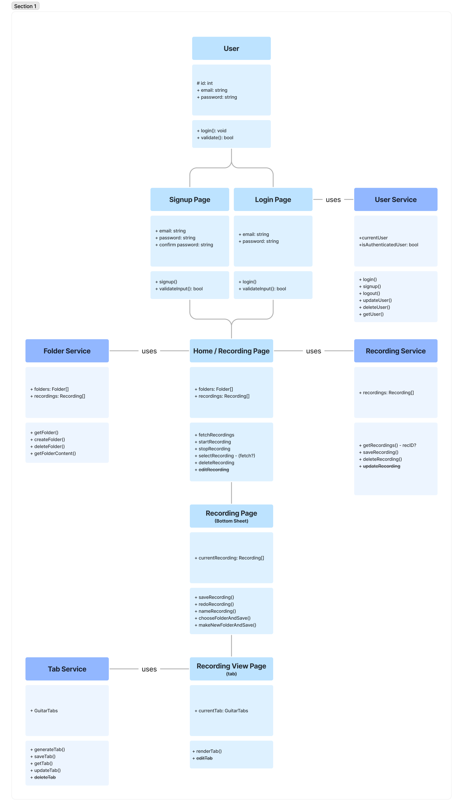
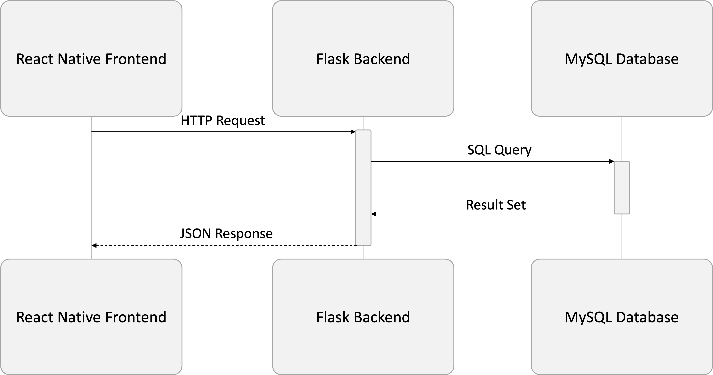

# Requirements and Specification Document

Built by Team Echo: Justin Benz, Jin Yong Choi, Camille Forster, Andy Liu, Aisha Mohamed, and David Viggiano

### Project Abstract

This cross-platform mobile application (**Echo: Voice to Tabs**) allows users to record audio - from hums to previously recorded tunes - and processes that audio into refined note sequences, to be played back or displayed in MIDI format, guitar tabs, and possibly sheet music. Users can also edit their previously recorded note sequences and export them for sharing or use in musical recreation.

### Customer

<!--A brief description of the customer for this software, both in general (the population who might eventually use such a system) and specifically for this document (the customer(s) who informed this document). Every project will have a customer from the CS506 instructional staff. Requirements should not be derived simply from discussion among team members. Ideally your customer should not only talk to you about requirements but also be excited later in the semester to use the system.-->

The application is designed for casual users or those new to composition or music in general. As such, not only should the UI be simple and straightforward to interact with, but the display format and editor for recordings should not be overly complex. While the exportable formats of recordings should be sufficient for more advanced musicians, the application should be friendly for any given user, even just a non-musical user who would like a refined playback of any given tune they have in mind.

### User Requirements

<!--TODO: This section lists the behavior that the users see. This information needs to be presented in a logical, organized fashion. It is most helpful if this section is organized in outline form: a bullet list of major topics (e.g., one for each kind of user, or each major piece of system functionality) each with some number of subtopics.-->

Here is a user requirements sample from [Crookshanks](https://learning-oreilly-com.ezproxy.library.wisc.edu/library/view/practical-software-development/9781484206201/9781484206218_Ch02.xhtml):

| ID   | Description                                                  | Priority | Status |
| ---- | ------------------------------------------------------------ | -------- | ------ |
| R11  | Users should not have to sign into the system; their current network login should be used for identification. | Med      | Done   |
| R12  | The user should pick a project first; the tasks available are a derivative of the project. | High     | Open   |
| R13  | A full-time employee should not be able to submit a time card with less than 40 hours per week recorded. | High     | Open   |
| R14  | A contractor can submit any number of hours up to 60 without special approval. | Med      | Open   |
| R15  | A team lead can see his/her team's time cards before they are submitted but cannot approve them until the user submits it. | High     | Open   |

<small><i>Excerpt from Crookshanks Table 2-2 showing example user requirements for a timekeeping system</i></small>

- You 
  - Can
    - Use
- Bullet
  - Points
    - In
    - Markdown

### Use Cases & User Stories

<!--Use cases and user stories that support the user requirements in the previous section. The use cases should be based off user stories. Every major scenario should be represented by a use case, and every use case should say something not already illustrated by the other use cases. Diagrams (such as sequence charts) are encouraged. Ask the customer what are the most important use cases to implement by the deadline. You can have a total ordering, or mark use cases with “must have,” “useful,” or “optional.” For each use case you may list one or more concrete acceptance tests (concrete scenarios that the customer will try to see if the use case is implemented).-->

During our next meeting with our customer (Daniel), we will ask for an ordering in terms of priority and necessity.

#### Guitar/Bass Player

> As a guitar/bass player, in order to make a song, I want to be able to hum a melody and play lead notes.
> As a guitar/bass player, in order to make a song, I want to be able to hum a melody and play rhythm chords.
> As a guitar/bass player, to collaborate on songs, I want to be able to share my recordings as tablature to my bandmates or friends.
> As a guitar/bass player, I would like to be able to see different ways to play the note I hum.
> As a guitar/bass player, I would like to store multiple samples so that I can quickly go over in recording session.

#### Piano Player

> As a piano player, in order to make a song, I want to be able to hum a melody and play that on my piano.
> As a piano player, to collaborate on songs, I want to be able to share my recordings as sheet music to my bandmates or friends.

#### All Musicians

> As a musician, to continuously work on my songs, I want to be able to have a library of my saved melody recordings.
> As a musician, I want to be able to make sub folders for my recordings in order to keep my library organized.
> As a musician, to collaborate on songs, I want to be able to share my recordings as an mp3 to my bandmates or friends.
> As a musician, I would like to see a midi display for my recording samples.
> As a musician, to add my own renditions and fixes, I would like to edit the notes displayed on the transcribed echo app.
> As a musician, I would like to be able to play my melodies with different instruments.

#### General

> As a user, I would like to select a number of recordings and delete them all.
> As a user, I would like to select a number of recordings and organize in a specific folder.
> As a user, I would like to export selected recordings/tabs.

### User Interface Requirements

<!--TODO: Describes any customer user interface requirements including graphical user interface requirements as well as data exchange format requirements. This also should include necessary reporting and other forms of human readable input and output. This should focus on how the feature or product and user interact to create the desired workflow. Describing your intended interface as “easy” or “intuitive” will get you nowhere unless it is accompanied by details.-->

<!--NOTE: Please include illustrations or screenshots of what your user interface would look like -- even if they’re rough -- and interleave it with your description.-->

### Security Requirements

<!--Discuss what security requirements are necessary and why. Are there privacy or confidentiality issues? Is your system vulnerable to denial-of-service attacks?-->

While recordings should be shareable, it is possible that users would like to protect their tunes as intellectual property. As such, recordings should be restricted by default to only be viewable by their creators, and user accounts should be restricted by a login with sufficient encryption protocols in place.

### System Requirements

<!--TODO: List here all of the external entities, other than users, on which your system will depend. For example, if your system inter-operates with sendmail, or if you will depend on Apache for the web server, or if you must target both Unix and Windows, list those requirements here. List also memory requirements, performance/speed requirements, data capacity requirements, if applicable.-->

| You    |    can    |    also |
| ------ | :-------: | ------: |
| change |    how    | columns |
| are    | justified |         |

### Specification

<!--A detailed specification of the system. UML, or other diagrams, such as finite automata, or other appropriate specification formalisms, are encouraged over natural language.-->

<!--TODO: convert diagrams from pictures to MD for easy editing-->

#### Technology Stack

#### Database

#### Class Diagram

#### Flowchart

#### Behavior

<!--TODO: is this required given our flowchart?-->

#### Sequence Diagram

### Standards & Conventions

Our coding standards and conventions can be found in [this document](Echo_Coding_Standards.md).
